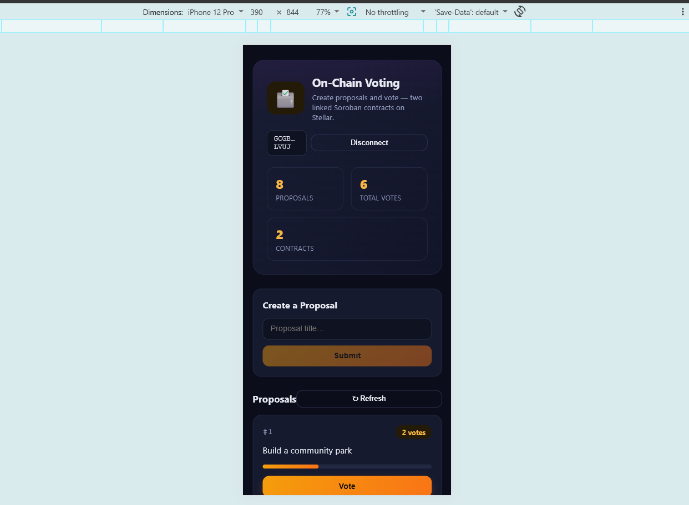
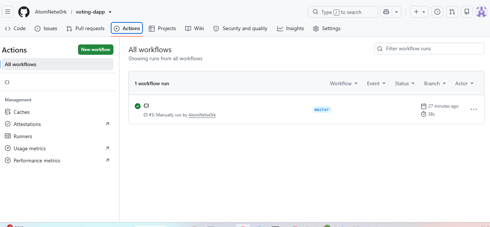
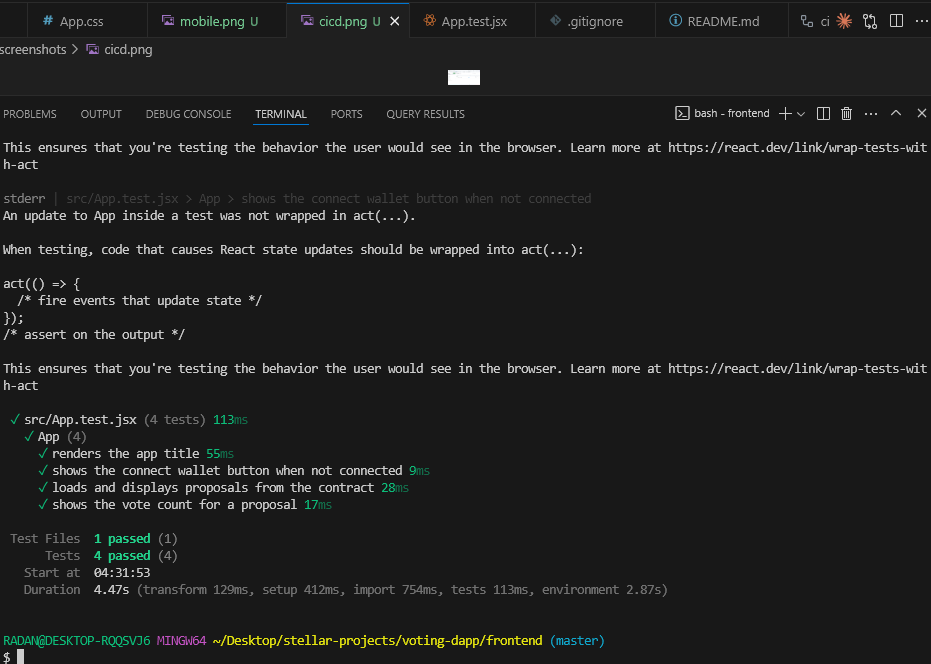

# 🗳️ On-Chain Voting — Stellar dApp

A full-stack decentralized voting application built on the **Stellar** network with **Soroban** smart contracts. Anyone can create a proposal and cast a single vote per proposal — every vote is recorded permanently on-chain.

🔗 **Live demo:** https://voting-dapp-one-phi.vercel.app/

---

## ✨ Features

- **Create proposals** stored on-chain
- **One vote per wallet, per proposal** (enforced by the contract)
- **Real-time updates** — the UI polls on-chain events and refreshes automatically
- **Wallet connection** via Freighter (Stellar Wallets Kit)
- **Responsive UI** that works on mobile and desktop
- **Loading and error states** for every on-chain action
- **Copyable transaction hash** with a direct link to Stellar Expert

---

## 🏗️ Architecture

The app uses **two smart contracts** that talk to each other (cross-contract calls):

| Contract | Responsibility |
| --- | --- |
| **Registry** | Stores proposals and their vote counts. Exposes `create_proposal`, `get_proposals`, `add_vote`. Emits events. |
| **Voting** | Handles authentication, prevents double voting, and calls the Registry's `add_vote` via a cross-contract invocation. Exposes `init`, `vote`, `has_voted`, `get_registry`. |

​
Frontend (React)  ->  Voting contract  ->  Registry contract
(auth,             (state:
no double vote)    proposals + votes)

---

## 📍 Deployed contracts (Testnet)

| Contract | Address |
| --- | --- |
| Registry | `CDQDIKMCN55C4N5R5D4S3QZQCLFZ5ZLK6TS7Z66MMGJURVJTQEM5QYT5` |
| Voting | `CBHUKSTU6JA2LFOMOLG5BXCW73QJPFVOMF6X4VB2DJPIDQLEWBCAA57Y` |

- **Network:** Testnet
- **Example transaction:** [`7b82e32298ab108349d2182f9959d2862c989169396aa7ab7185eefb2d34808e`](https://stellar.expert/explorer/testnet/tx/7b82e32298ab108349d2182f9959d2862c989169396aa7ab7185eefb2d34808e)

---

## 🧰 Tech stack

- **Smart contracts:** Rust + Soroban SDK
- **Frontend:** React + Vite
- **Wallet:** Freighter via `@creit.tech/stellar-wallets-kit`
- **Stellar SDK:** `@stellar/stellar-sdk`
- **Tests:** Vitest + Testing Library
- **CI/CD:** GitHub Actions
- **Hosting:** Vercel

---

## 🚀 Getting started

### Prerequisites

- [Rust](https://www.rust-lang.org/tools/install) + the `wasm32v1-none` target
- [Stellar CLI](https://developers.stellar.org/docs/tools/developer-tools/cli)
- Node.js 22+

### Smart contracts

​
from the repo root
stellar contract build
stellar contract test

### Frontend

​
cd frontend
npm install
npm run dev

The app runs at `http://localhost:5173`.

---

## 🧪 Testing

Frontend tests use Vitest:

​
cd frontend
npm test

---

## 🔄 CI/CD

Every push to `main` triggers a **GitHub Actions** workflow that installs dependencies, runs the frontend tests, and builds the app. See `.github/workflows/ci.yml`.

---

## 📸 Screenshots

| Mobile UI | CI/CD passing | Tests passing |
| --- | --- | --- |
|  |  |  |

---

## 📄 License

MIT
​
